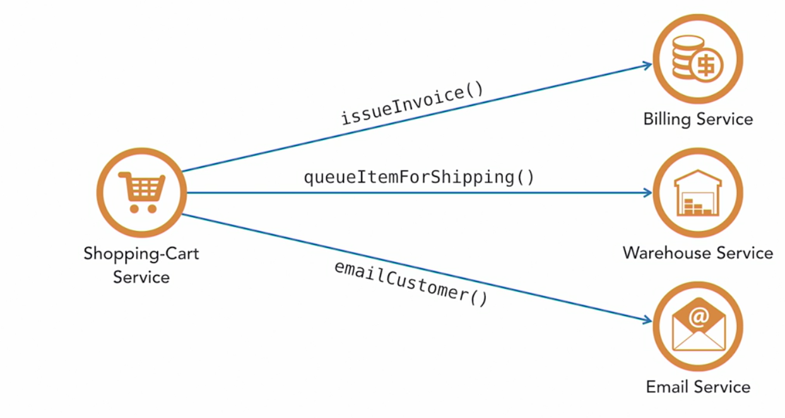
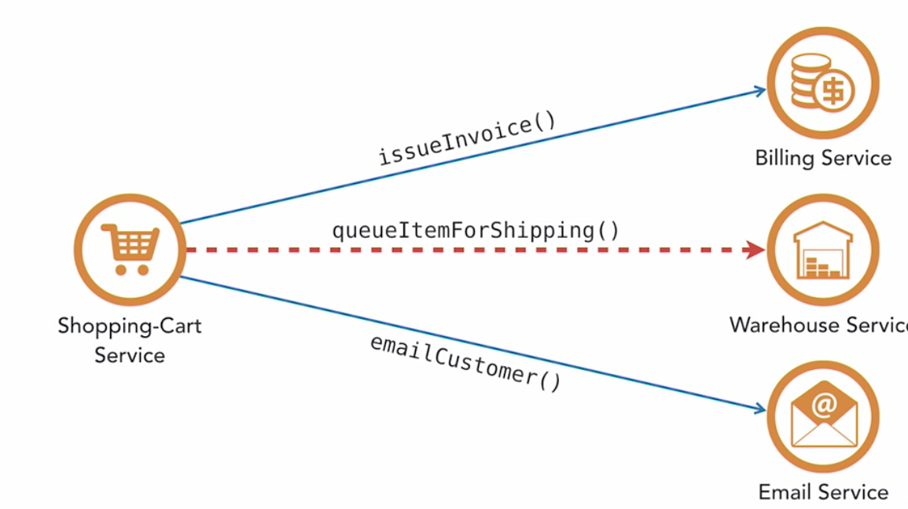

# Domain-Driven Design

- If you don't need independent deployability, there is no real reason to go to microservices. If you don't need it, maybe just do DDD in monoliths.

## Bounded Contexts and Entities

- Keep everything context-sensitive and specific
- In the case of bookstore application where we have two context/entities - store for selling book and warehouse for shipping book, instead of having one large Product entity/table, we would have two separate Product table in different databases for each context.

## Orchestrated/Declarative System

- Synchrounous Services
- One entity tells another entity what to do
- Have a tight relationship between services. Change one service will affect another as it communicate directly.

## Choreography/Reactive System

- Asynchronous Services
- Eliminates coupling relationships between downstream and upstream services
- Also called a publish-subscribe model. Subscribers are unknown to the publishers. Use a messaging system such as - kafka, rabbitmq, zeromq

## Event Storming

