# Microservices Foundation

## Decompositon

Breaking a software problem into smaller pieces that are easier to understand and solve.

### System Decomposition

Breaking a system into smaller units that make it easier to solve a series of system problems.

## Cost

- Complexity; Development and deployment as the number of services grow
- Network Call: Many calls between services might cause the problem
- Reliability: If one service fall, it might affect the others
- Possible code redundancies
- Harder to roll out new versions
- Harder to test (mocking the other services)
- Complexity is moved to the network layer

## Communication

- REST

## Benefits

- Scalability
- Distribution

## Gridlock

- Strong timeout: when the service fail, don't affect the other services. Just shut it down.

## Bound Context

- Whether to group component/service together (domain, latency, call)
- LogIn and Shipping Cart should be the same domain?
- Decide on scope and domain

## Data Domain as service boundary

- Building data domain for lower
- Decompose data domain for smaller component

### Transactional Boundaries

- Cannot eliminate transactions completely
- No distributed transactions
- if we need to leverage transaction just to go to microservices, Don't do it.

## Migrate to Microservices

### Breakdown the database

- Breakdown the Monolithic DB into various DB and create each microservice application to each DB 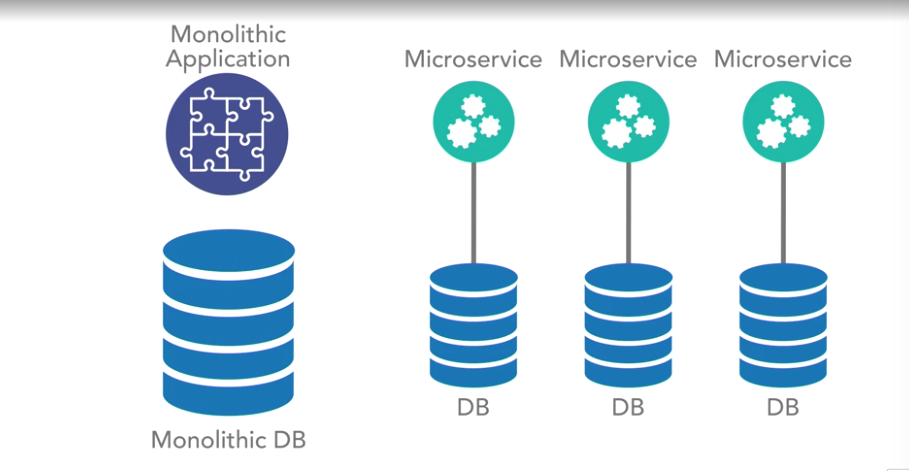

- Start breakdown the Monolithic application into various Microservices, then modeling its own data domain (to avoid cross domain call), then finally decompose Monolithic DB to each domain DB 

### Distributed Transaction

- ACID transactions vs BASE
- Atomi: Either succeeds completely or fails completely
- Consistent: Constraints of underlying datastore are enforced (Data model constraint rule)
- Isolated: (Visibility rule) in which no application can read data not in the correct state. Cannot be read by other transactions until in a specific state based on isolation rules
- Durable: Once saved, guraranteed to be in the datastore until modified (after transaction is completed).

- Embrace BASE and strive for eventual consistency.
- In a BASE model, we strive for eventual consistency across the highly available distributed platform, which is the exact use case a microservices architecture aims to work in. In this eventual consistency model, we are not guaranteed immediate, atomic, or isolated consistent transactions. Instead, we aim for a situation where, assuming the data isn't modified again, we will eventually achieve the end state in all of the nodes across our distributed datastore.

- We need to identify which part require ACID, and wrap service boundary around them (cannot be leveraged). But maybe we dont need ACID at all in some case, for Example, User sometimes doesnt immediately view the data.
- Bank Transaction: Deposit and Withdraw -> ACID, Bank loan -> BASE (eventual consistency)

## API Layer

- Is the aggregated proxy of your all API endpoints available
- API layer should not doing any transforming or execution logic (mobile and desktop api endpoint)
- A pure proxy
- Dont breaking change the API but introduce the new version
- API Layer benefit
  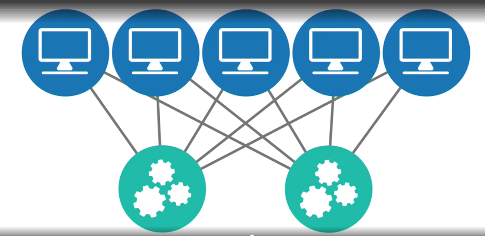

  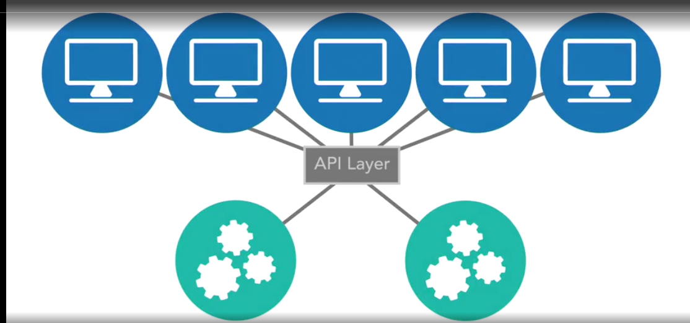
- Migration API Layer first. Create API layer of the Monolithic, versioning (legacy to monolithic and new version to new services, wrapper functions) 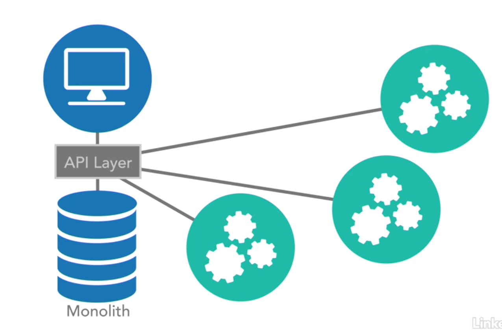
- API Layer is optional but it is better for migration to Microservices

## Asynchronous Communication

- Stream Data platform 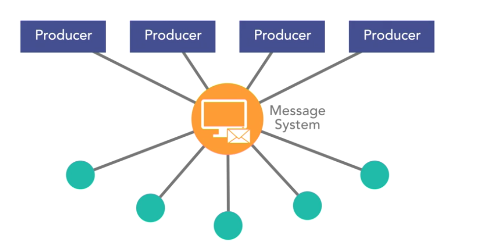
- Error recover mechanism
- Data should be regularly evaluated

## Logging and tracing

- Call chain, aggregate logs, different team -> different logs
- Very difficual to debug and troubleshoot (different containers, sessions, ...)
- Plan for unified logging strategies across your entire platform
- Tracing: able to trace log in one service and accross service, passing a token (TraceID) with the log and call stack
  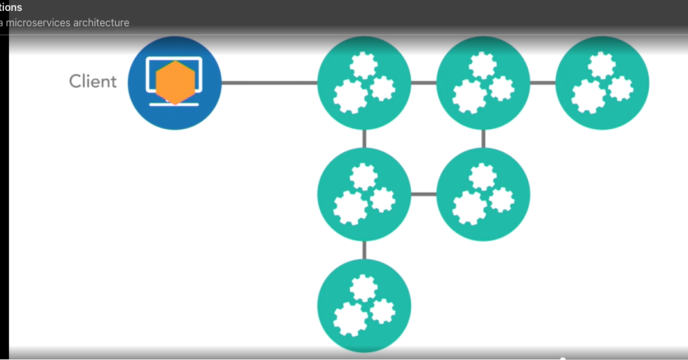

  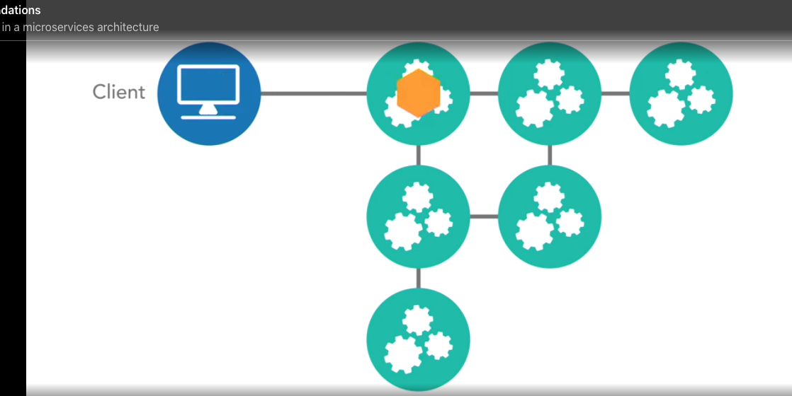

## Continuous Delivery

- Is a requirement to achieve agility in a microservices architecture
- Agility is a part of Microservice because it has so many moving parts
- Deployment to Non-Production server which doesnt affect production request , conduct testing there (Integration Testing, System Testing, Security Testing, etc..)
- Non-Production server -> [blue-green deployment](https://blog.christianposta.com/deploy/blue-green-deployments-a-b-testing-and-canary-releases) -> Production Server

## Hybrid architectures

### Hierarchical Service Architectures

- Prevents Circular dependencies. Define what services to call what services.
- Models an [n-tier architecture](https://www.techopedia.com/definition/17185/n-tier-architecture#:~:text=N%2Dtier%20architecture%20is%20a,both%20logically%20and%20physically%20separated.) via services instead of modules 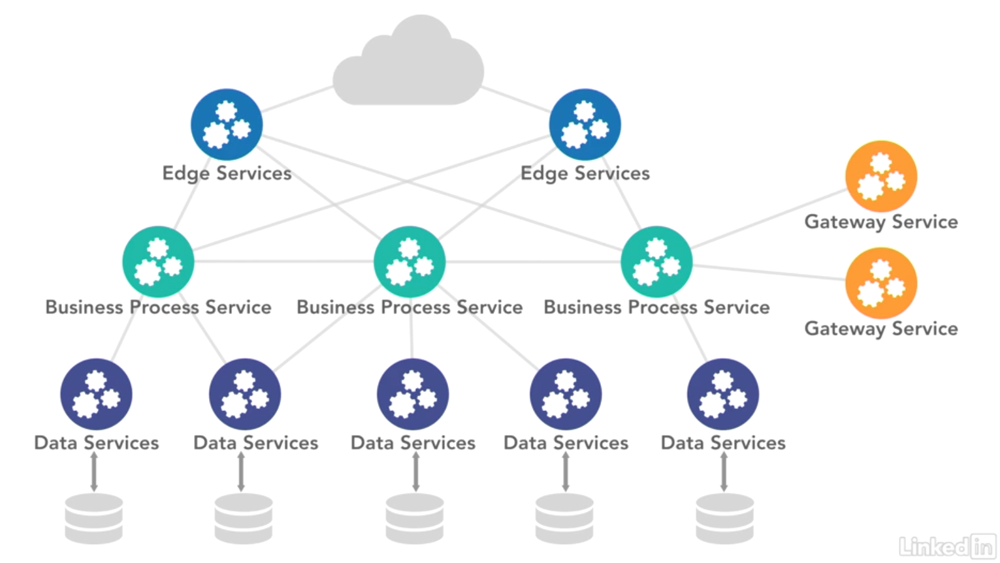

### Service-Based Architecture

- Similar to SOA
- Single underlying database (leave DB alone)
- Leverages services to handle decompositions
- Gains some agiligy without modifications to the datastore
- It might lead to monolithic of monolithic system, since we dont define data domain constraint 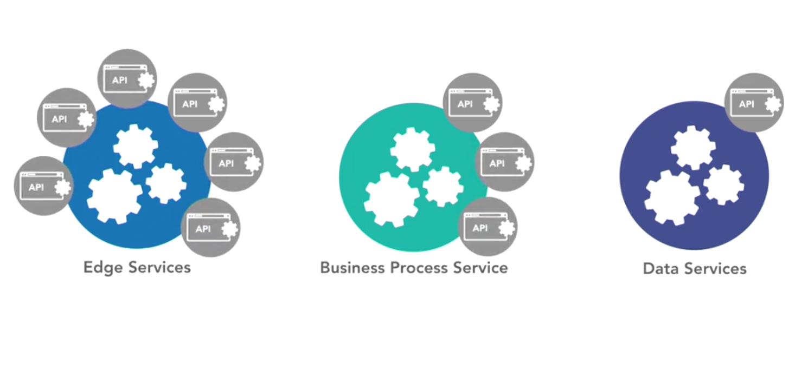

## Design Considerations

- CI/CD
- Logging and tracing
- Data domain, service boundaries (what functions to perform)
- ACID vs BASE, Grouping Services together vs. build strategies based on eventual consistency
- Create measurement to evaluate (latency, non-blocking code, etc)
- Design Asynchronous first and Synchronous later

## The Tradeoffs

- Distribution Tax
- Complexity
- Latency

### Issues of Complexity

- Scalability and deployments
- Large number of moving parts

This can be solved by CI/CD

### Benefits of paying the distribution tax

- Distributability
- Well-defined service boundaries
- Scalability

### Polyglot Development Practices

- Many procs and cons
- Use it as a tool
- Consider standardization

## Edge Services

In a microservices architecture, you often leverage an API proxy to hide your service implementations behind a common proxy layer. But again, this layer can become bloated if you start transforming your service offerings based on client needs.

### Inbound/Translation Edge Services

- Abstract you from the third-party dependencies
- Build Edge Services to communicate between your system and third party (For example, Abstract Mail Service to communicate with third parties vendor such as MailChimp, SendGrid, ...). The System -> Mail Edge Service -> Vendor (MailChimp, SendGrid, ...) to prevent breaking change from vendor, switch vendor 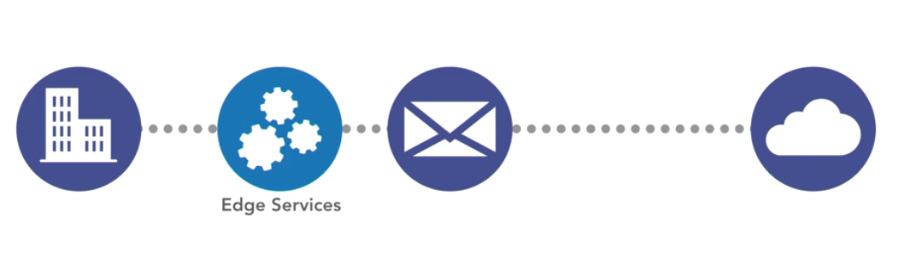

### Outbound Edge services

- Expose your client's specific needs to the outside world
- Create Edge service to communicate with different type of clients (mobile and desktop) instead of writing those transformation logic in proxy server or API gateway (Pic 12)

## DevOps

- Most of the problems coming from operation issues
- Monitor a microservice system to ensure lag doesn't have major impacts.
- Automated monitoring and response

## Service Discovery

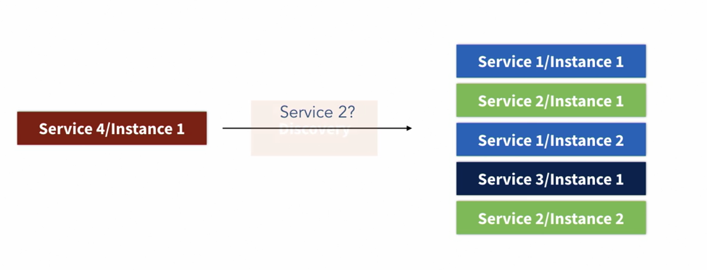
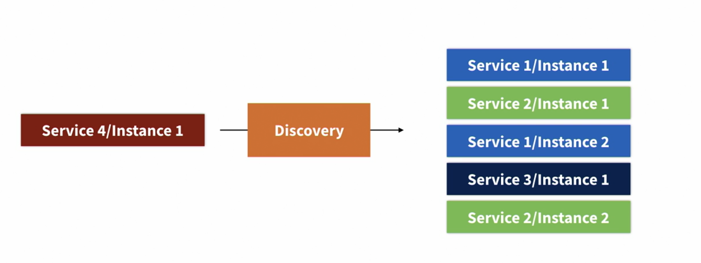

### Service Mesh

- Used on Container Infrastructure (Kubernetes)
- In such infrastructures, the containers run in a software-defined network, and as such the container engine can keep track of all services and change the network settings in a way that the request is routed to the right end point. In Kubernetes for instance, usually istio and envoy provide this functionality.

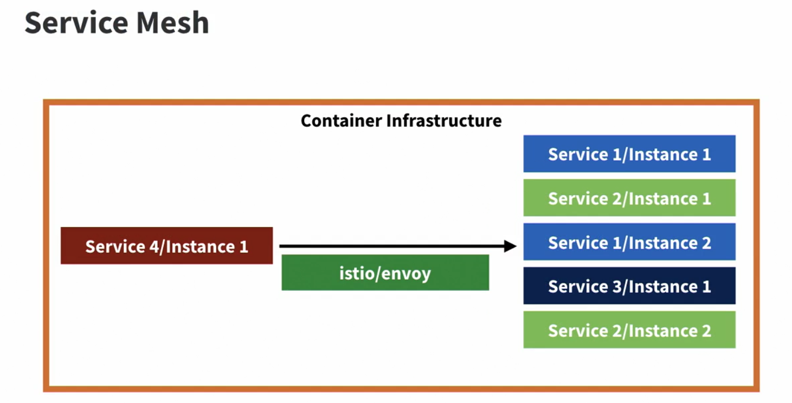

### Service Registry

- Application Level Component
- If you don't have control over the network and over the engine that spins up the new services, we cannot use the infrastructure layer to do the routing for us. In such scenarios, the service registry is the pattern of choice. It is an application-level component. When a new service comes to life it only has to know where to find the service registry, and this can be provided through the network layer and DNS. It will then register itself to the registry. If we now want to know where the service can be found, we simply have to query the registry for a given service, and it will return the needed endpoint information. Ideally, when there are several instances of one service, the registry will not always provide the endpoint for the same instance, but will try to distribute the load either randomly or round robin.

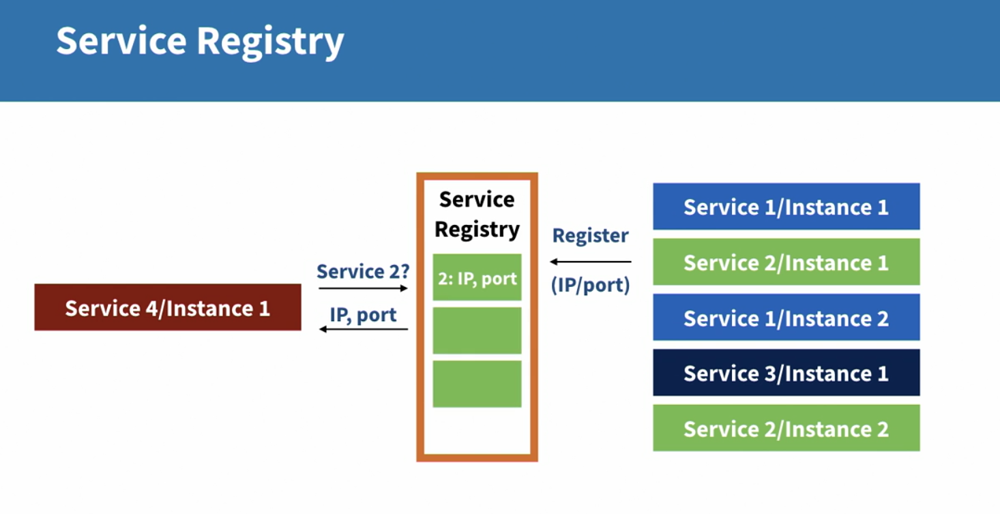

## What happens if a Service Fail

- If poorly managed, one service down might bring the whole system down.

### Circuit Breakers

- If a service fail, shut it down.
- After some time, half start (accepting 1 request), if it is working, full start
- Everytime it fail, should increase the cooldown timeout exponentially

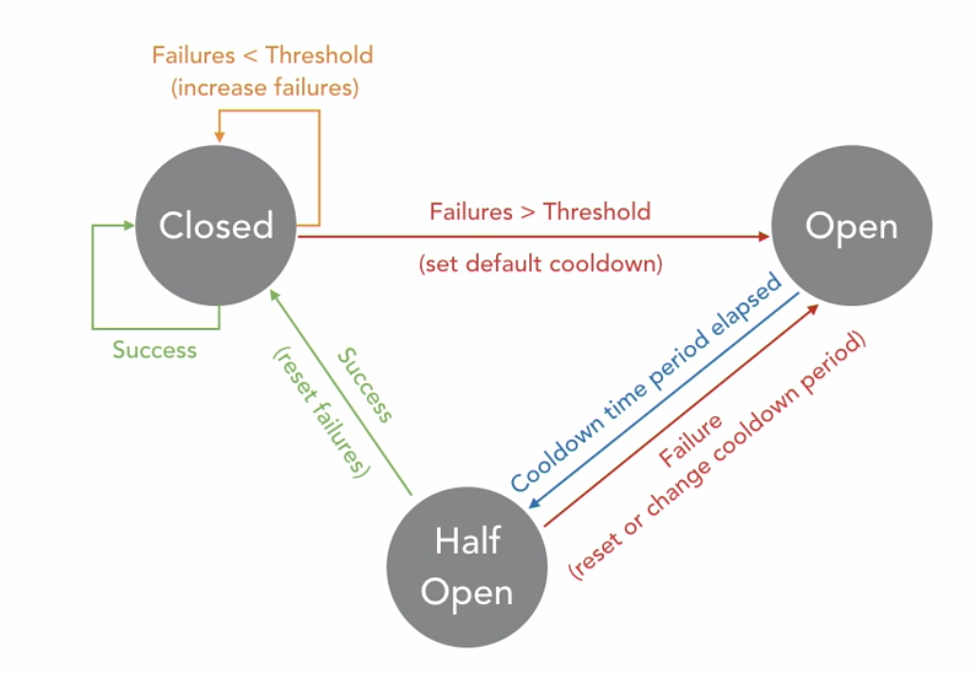

## Resilient

- The cruical part is failure of service registry and discovery -> create several service registery that maintain service in their databases.
- If one service fail, shut it down with circuit breakers -> create several service instance
- Implement caches wherever can fit

## Queuse

- One goal in Microservice is to avoid tight coupling.
- It's hard to uncouple request that are needed to show data on the website instantly
- But when it comes to posting data to a service, doing that asynchronously through some intermediate service removes any dependency between caller and recieving services -> Use Queue System

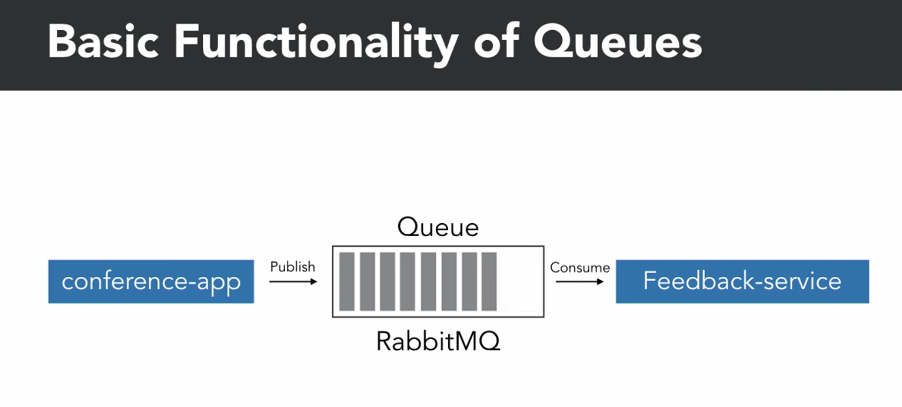
