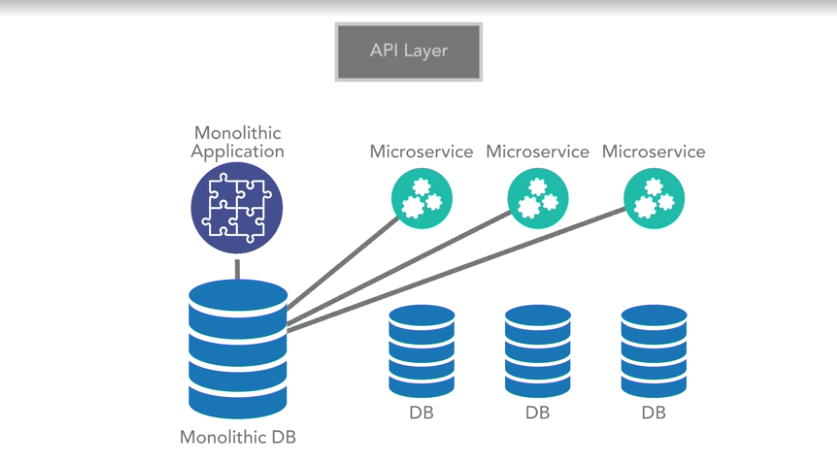

# Microservices Foundation

## Decompositon

Breaking a software problem into smaller pieces that are easier to understand and solve.

### System Decomposition

Breaking a system into smaller units that make it easier to solve a series of system problems.

## Cost

- Complexity; Development and deployment as the number of services grow
- Network Call: Many calls between services might cause the problem
- Reliability: If one service fall, it might affect the others
- Possible code redundancies
- Harder to roll out new versions
- Harder to test (mocking the other services)
- Complexity is moved to the network layer

## Communication

- REST

## Benefits

- Scalability
- Distribution

## Gridlock

- Strong timeout: when the service fail, don't affect the other services. Just shut it down.

## Bound Context

- Whether to group component/service together (domain, latency, call)
- LogIn and Shipping Cart should be the same domain?
- Decide on scope and domain

## Data Domain as service boundary

- Building data domain for lower
- Decompose data domain for smaller component

### Transactional Boundaries

- Cannot eliminate transactions completely
- No distributed transactions
- if we need to leverage transaction just to go to microservices, Don't do it.

## Migrate to Microservices

### Breakdown the database

- Breakdown the Monolithic DB into various DB and create each microservice application to each DB 

- Start breakdown the Monolithic application into various Microservices, then modeling its own data domain (to avoid cross domain call), then finally decompose Monolithic DB to each domain DB 

### Distributed Transaction

- ACID transactions vs BASE
- Atomi: Either succeeds completely or fails completely
- Consistent: Constraints of underlying datastore are enforced (Data model constraint rule)
- Isolated: (Visibility rule) in which no application can read data not in the correct state. Cannot be read by other transactions until in a specific state based on isolation rules
- Durable: Once saved, guraranteed to be in the datastore until modified (after transaction is completed).

- Embrace BASE and strive for eventual consistency.
- In a BASE model, we strive for eventual consistency across the highly available distributed platform, which is the exact use case a microservices architecture aims to work in. In this eventual consistency model, we are not guaranteed immediate, atomic, or isolated consistent transactions. Instead, we aim for a situation where, assuming the data isn't modified again, we will eventually achieve the end state in all of the nodes across our distributed datastore.

- We need to identify which part require ACID, and wrap service boundary around them (cannot be leveraged). But maybe we dont need ACID at all in some case, for Example, User sometimes doesnt immediately view the data.
- Bank Transaction: Deposit and Withdraw -> ACID, Bank loan -> BASE (eventual consistency)

## API Layer

- Is the aggregated proxy of your all API endpoints available
- API layer should not doing any transforming or execution logic (mobile and desktop api endpoint)
- A pure proxy
- Dont breaking change the API but introduce the new version
- API Layer benefit
  

  
- Migration API Layer first. Create API layer of the Monolithic, versioning (legacy to monolithic and new version to new services, wrapper functions) 
- API Layer is optional but it is better for migration to Microservices

## Asynchronous Communication

- Stream Data platform 
- Error recover mechanism
- Data should be regularly evaluated

## Logging and tracing

- Call chain, aggregate logs, different team -> different logs
- Very difficual to debug and troubleshoot (different containers, sessions, ...)
- Plan for unified logging strategies across your entire platform
- Tracing: able to trace log in one service and accross service, passing a token (TraceID) with the log and call stack
  

  

## Continuous Delivery

- Is a requirement to achieve agility in a microservices architecture
- Agility is a part of Microservice because it has so many moving parts
- Deployment to Non-Production server which doesnt affect production request , conduct testing there (Integration Testing, System Testing, Security Testing, etc..)
- Non-Production server -> [blue-green deployment](https://blog.christianposta.com/deploy/blue-green-deployments-a-b-testing-and-canary-releases) -> Production Server

## Hybrid architectures

### Hierarchical Service Architectures

- Prevents Circular dependencies. Define what services to call what services.
- Models an [n-tier architecture](https://www.techopedia.com/definition/17185/n-tier-architecture#:~:text=N%2Dtier%20architecture%20is%20a,both%20logically%20and%20physically%20separated.) via services instead of modules 

### Service-Based Architecture

- Similar to SOA
- Single underlying database (leave DB alone)
- Leverages services to handle decompositions
- Gains some agiligy without modifications to the datastore
- It might lead to monolithic of monolithic system, since we dont define data domain constraint 

## Design Considerations

- CI/CD
- Logging and tracing
- Data domain, service boundaries (what functions to perform)
- ACID vs BASE, Grouping Services together vs. build strategies based on eventual consistency
- Create measurement to evaluate (latency, non-blocking code, etc)
- Design Asynchronous first and Synchronous later

## The Tradeoffs

- Distribution Tax
- Complexity
- Latency

### Issues of Complexity

- Scalability and deployments
- Large number of moving parts

This can be solved by CI/CD

### Benefits of paying the distribution tax

- Distributability
- Well-defined service boundaries
- Scalability

### Polyglot Development Practices

- Many procs and cons
- Use it as a tool
- Consider standardization

## Edge Services

In a microservices architecture, you often leverage an API proxy to hide your service implementations behind a common proxy layer. But again, this layer can become bloated if you start transforming your service offerings based on client needs.

### Inbound/Translation Edge Services

- Abstract you from the third-party dependencies
- Build Edge Services to communicate between your system and third party (For example, Abstract Mail Service to communicate with third parties vendor such as MailChimp, SendGrid, ...). The System -> Mail Edge Service -> Vendor (MailChimp, SendGrid, ...) to prevent breaking change from vendor, switch vendor 

### Outbound Edge services

- Expose your client's specific needs to the outside world
- Create Edge service to communicate with different type of clients (mobile and desktop) instead of writing those transformation logic in proxy server or API gateway (Pic 12)

## DevOps

- Most of the problems coming from operation issues
- Monitor a microservice system to ensure lag doesn't have major impacts.
- Automated monitoring and response

## Service Discovery

### Service Mesh

- Used on Container Infrastructure (Kubernetes)
- In such infrastructures, the containers run in a software-defined network, and as such the container engine can keep track of all services and change the network settings in a way that the request is routed to the right end point. In Kubernetes for instance, usually istio and envoy provide this functionality.

### Service Registry

- Application Level Component
- If you don't have control over the network and over the engine that spins up the new services, we cannot use the infrastructure layer to do the routing for us. In such scenarios, the service registry is the pattern of choice. It is an application-level component. When a new service comes to life it only has to know where to find the service registry, and this can be provided through the network layer and DNS. It will then register itself to the registry. If we now want to know where the service can be found, we simply have to query the registry for a given service, and it will return the needed endpoint information. Ideally, when there are several instances of one service, the registry will not always provide the endpoint for the same instance, but will try to distribute the load either randomly or round robin.

## What happens if a Service Fail

- If poorly managed, one service down might bring the whole system down.

### Circuit Breakers

- If a service fail, shut it down.
- After some time, half start (accepting 1 request), if it is working, full start
- Everytime it fail, should increase the cooldown timeout exponentially

## Resilient

- The cruical part is failure of service registry and discovery -> create several service registery that maintain service in their databases.
- If one service fail, shut it down with circuit breakers -> create several service instance
- Implement caches wherever can fit

## Queuse

- One goal in Microservice is to avoid tight coupling.
- It's hard to uncouple request that are needed to show data on the website instantly
- But when it comes to posting data to a service, doing that asynchronously through some intermediate service removes any dependency between caller and recieving services -> Use Queue System

# Design Patterns

## Service Types

- Data Service: frequently bound by data domain - Product Data Service
- Business Service: Order Business Service (consist of product, inventory, order, payment...)
- Translation Service: Abstraction for 3rd party service - Mail Service, Log Service. Easier when changing vendor or version without changing the underlying services
- Edge Service: External service to user, web view, mobile content, or custom payload

## Decomposition Patterns

### Domain Based

- Data Domains: low level of decompositions, the most efficient way
- Focus on the data pattern (the accessing data pattern) not the underlying schema

- Start with the model, not the datastore
- Define actions need to perform on the model
- Build API based on the actions

### Business Process Based

- Identify Process
- Identify Domain
- Define API
- Wire Service

### Atomic Transactoin Based

- Guarantee atomicity, consistency, isolation, durability transatctions across domain
- Provide failure domains and rollbacks
- Force blocking until committed
- Don use distributed transactions or data domain!
- Domains must be in shared database
- Strategies for fast fail and rollback

## Decomposition Strategies

### Strangler Pattern

- Break a monolith up by "strangling" the dependency on it. Start service pieice by piece, point to a new service and depreate the old service
- Top Down: API -> Datastore
- Bottom Up: Datastore -> API

### Sidecar Pattern

- Used to offload processing
- Removing repetitive code across Services
- Used for loggin, monitoring, network services can be offloaded to a separate module

- Determine the process
- Build the sidecar
- Schedule it to deploy with the appropriate services. Deploy along with the parent service

## Integration Patterns

### API Gateway patterns

- Problems: Client ability to call any service can create chaos
- Gateway is to create a buffer, provides a facade/proxy
- Single layer that proxies, mutates, or limits calls
- Can become a sinple point of failure

#### Mutation Behaviours

- Can simply proxy: Backend call, restrict, access, buffer, etc
- Can decorate payload: headers, ... in a consistent way
- Can aggregate: call underline call and aggregate the data here (but don apply business logic here!)
- Can limit access: limited data for limited client (2G, 3G)
- Movement buffer

#### Stratey

- Define contracts
- Expose APIs for thos contracts, client focused
- Adhere to strict version control and passive changes only
- Implement the gatway to call your services and your clients to call the gateway

### Process Aggregator Pattern

- Problem: You have several business process that must be called together and have a composite payload
- Aggregator provides clients a single API to call
- Subset of Gateway Pattern

#### Cons

- Can introduce its own processing logic
- Can cause long blocking calls

#### Design

- Determine the business process
- Determine the processing rules
- Design a consolidated model
- Design an API for the actions on that model
- Wire the service and implement the internal processing

### Edge Pattern

- Ingres Pattern
- Subset of Gateway Pattern
- Clients need special business logic or payload (Mobile, Rakuten, Hitachi)

#### Design Edge Pattern

- Identify clients
- Build contracts
- Implement contracts
- Maintain passivity as long as client is needed

#### Gatway vs. Edge

- Edge targets clients
- Edge is more scalable
- Gatway has less moving parts

## Data Patterns

### Single Service Databases

[Single Service](./images/SingleService.png)

- Solve the problem of scalability of databases and services
- Each service implementation gets its own datastore
- Datastore distributes with the service

### Shared Service Database

- All data domains exist within a single databse
- Data distribution should be handled by the database. Handle synchronization by database itself.
- How to isolate, use database key, schema, and so on
- Data domains connect to single schema -> so that we can break the database up later

### Command Query Responsibility Segregation

- Task-based UI operations. As the write model focuses on the tasks, the read models are based on the system state after the interactions from that task.
- Eventual consistency is a must
- Event-based models

### Asynchronous eventing

- Problems: Some processes cannot be done in real time
- Service API to trigger event
- Event can cascade asynchronously from API
- Event can trigger from messaging

## Operational Patterns

How you run your system than how you build the system.

### Log Aggregation

- Problem: You need to know what is going on
- Logging must be consistent and structured across all system
- Logging must share a taxonomy - what those key are and what key should we used when writing log

#### Aggregation

- Each service has its own log
- How to arggregate, parse
- Correlating of logs between services (with same key (taxonomy), trace id)
- Indexing of log, for faster searching

### Metrics Aggregation

- Problem: Need to see what is going on with the system on the system level
- Taxonomy
- Standard libraries
- Dashboards and Visualizations

#### Lessons Learned

- Build high-level dashboards: to see the troubleshooting where it start
- Build detailed dashboards for each service: dig down inside a service
- Trace alarms: Email and Slack alert
- Embed the runbooks (manual) of how to solve problems for all alarms

### Tracing

- Problems: Call stacks span processes and networks
- Tracing give you a way to recreate the call stack by injecting the trace Id

#### Implementation Tracing

- Use standards-based approaches
- Inject at the entry point to your system
- Every log message should embed the trace ID through structure logging with common taxonomy
- Use tool to visualize

### Service Discovery Operational Patterns

- Problem: What service do I call?
- Central location of all services
- Advertise what they offer
- Find what you need
- Consume the URI from the discovery engine, not config!
